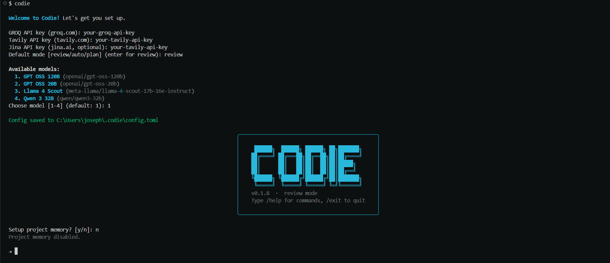
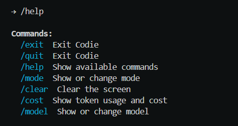
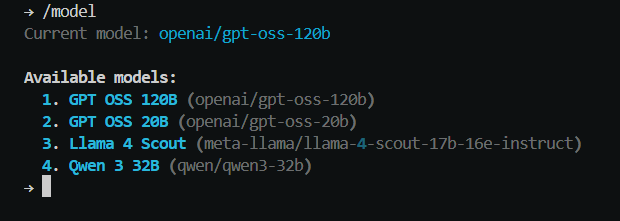
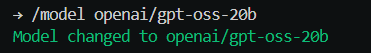
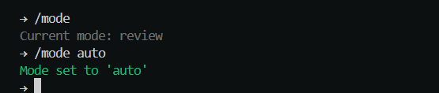
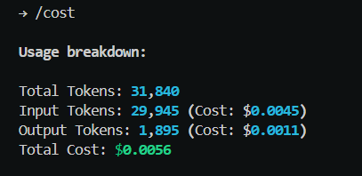

# Codie

**An AI-powered CLI coding agent. Reads, writes, and debugs your code.**


---

## What is Codie?

Codie runs in your terminal. You describe a task, it reads your files, writes code, runs commands, searches the web, and verifies its work — all without leaving your terminal.

```
→ build a REST API with FastAPI, add tests, and make sure it runs
  ⚙ Tool call: write_file
  ⚙ Tool call: write_file
  ⚙ Tool call: run_command
  ⚙ Tool call: run_debug
Codie: Done. Server running on port 8000, all tests passing.
```

---

## Features

- **File tools** — read, write, edit, delete files in your project
- **Shell access** — run commands with mode-aware confirmation
- **Code search** — ripgrep-powered search across your codebase
- **Web tools** — search the web and read documentation pages
- **Debug loop** — automatically runs lint and tests after writing code
- **Project memory** — remembers your stack, conventions, and key files across sessions
- **Token tracking** — see exactly how much each session costs with `/cost`
- **Model switching** — switch between models mid-session with `/model`

---

## Requirements

- Python 3.10+
- ripgrep — install before using Codie:
  - Windows: `winget install BurntSushi.ripgrep.MSVC`
  - Mac: `brew install ripgrep`
  - Linux: `apt install ripgrep`
- A [Groq API key](https://console.groq.com) (free)
- A [Tavily API key](https://tavily.com) (free, 1000 searches/month)
- A [Jina API key](https://jina.ai) (free, 500 RPM)

---

## Installation

```bash
pip install codie-cli
```

---

## First Run

On first run, Codie walks you through setup:



```
Welcome to Codie! Let's get you set up.

GROQ API key (groq.com): ...
Tavily API key (tavily.com): ...
Jina API key (jina.ai, optional): ...
Default mode [review/auto/plan] (enter for review): review

Available models:
  1. GPT OSS 120B
  2. GPT OSS 20B
  3. Llama 4 Scout
  4. Qwen 3 32B

Config saved to ~/.codie/config.toml
```

To update your keys or change model at any time:

```bash
codie --configure
```

---

## Usage

```bash
codie                  # start in default mode
codie --mode auto      # start in auto mode
codie --mode plan      # start in plan mode
codie --version        # show version
codie --configure      # update API keys and settings
```

---

## Modes

| Mode | Behavior |
|------|----------|
| `review` | Confirms each file edit and mutating shell command |
| `auto` | Runs without asking (still confirms destructive commands) |
| `plan` | Shows full plan, user approves once, then executes |

---

## Slash Commands



| Command | Description |
|---------|-------------|
| `/help` | Show available commands |
| `/mode <mode>` | Change mode mid-session |
| `/model` | Show current model and available models |
| `/model <model>` | Switch model mid-session |
| `/cost` | Show token usage and cost for this session |
| `/remember <thing>` | Save something to project memory |
| `/clear` | Clear the screen |
| `/exit` | Exit Codie |

---

## Model Switching





Switch models mid-session without restarting:

---

## Mode Switching

| Mode | Behavior |
|------|----------|
| `review` | Confirms each file edit and mutating shell command |
| `auto` | Runs without asking (still confirms destructive commands) |
| `plan` | Shows full plan first, user approves once, then executes all |




## Project Memory

Codie can maintain a `.codie/AGENT.md` file in your project — your stack, conventions, important files, and notes injected into every session.

```bash
codie
# Setup project memory? [y/n]: y
# Project memory created at .codie/AGENT.md
```

Add `.codie/AGENT.md` to git to share context with your team.

Use `/remember` to add notes mid-session:
```
→ /remember always use TypeScript strict mode
```

---

## Token Tracking



---

## Configuration

Config is stored at `~/.codie/config.toml`. Run `codie --configure` to update.

You can also use environment variables:

```bash
export GROQ_API_KEY=...
export TAVILY_API_KEY=...
export JINA_API_KEY=...
export CODIE_MODEL=openai/gpt-oss-120b
```

---

## License

MIT — built by [Josef Johnson](https://github.com/JosefStack)